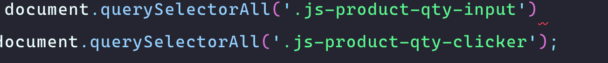

A pesar de que usar un linter no es nada nuevo, nunca había tenido que configurar uno desde cero. 

Después de investigar decidí irme por <a href="https://eslint.org/" target="_blank">ESLint</a> ya que parece ser el que más libertad da de configuración. No soy muy fanático de los linter opinionados que forzan estilos de código.

Estoy usando Gulp como corredor de tareas, así que que lo primero que debemos hacer es buscar un paquete en NPM que haga esta conexión como <a href="https://www.npmjs.com/package/gulp-eslint" target="_blank">gulp-eslint</a>

```bash
npm install --save-dev gulp-eslint
```

Me gusta usar un <a href="https://eslint.org/docs/user-guide/configuring#configuration-file-formats" target="_blank">archivo externo</a> de configuración, no me gusta tener toda la configuración de los linters en el `package.json` así que crearemos un archivo `.eslintrc.json`

### Gulpfile.js

En nuestro `gulpfile.js` debemos crear nuestra nueva tarea. Siguiendo las instrucciones del paquete

```js
const eslint 		= require('gulp-eslint');

gulp.task('js-eslint', function() {
	return gulp
		.src(
			['./ruta/a/scripts/*.js']
		)
		.pipe(eslint())
		.pipe(eslint.format())
		.pipe(eslint.failAfterError());
});
```

Y de verdad eso es básicamente todo para que funcione el linter 
<div style="width:100%;height:0;padding-bottom:51%;position:relative;"><iframe src="https://giphy.com/embed/1nPbJISNb8VSfMbHee" width="100%" height="100%" style="position:absolute" frameBorder="0" class="giphy-embed" allowFullScreen></iframe></div><p><a href="https://giphy.com/gifs/chrisgethardshow-trutv-chris-gethard-1nPbJISNb8VSfMbHee">via GIPHY</a></p>

Así que ahora debemos enfocarnos en nuestro `.eslintrc.json` y ver que configuraciones debemos pasar.

Así que debemos revisar <a href="https://eslint.org/docs/rules/" target="_blank">que reglas nos gustarían</a> y <a href="https://eslint.org/docs/user-guide/configuring#configuring-rules" target="_blank">cómo configurarlas</a>. Aquí depende de cada quien y de las preferencias de tu equipo. Voy a colocar algunas de las más comunes pero nunca está demás darse una vuelta por el archivo para revisar todas las opciones.

Lo primero es el nivel de error que queremos, hay tres posibles niveles:

* `"off"` ó 0 - Apaga la regla
* `"warn"` ó 1 - La regla es una advertencia (no detiene el código)
* `"error"` ó 2 - La regla es un error (Detiene el código hasta que está arreglada)

La mayoría de las veces yo prefiero usar error, es mejor arreglar el error de una vez cuando se presenta, pero hay ciertas cosas como el uso de comillas simples o dobles donde es mejor usar una advertencia. Pero de nuevo, aquí depende del criterio de cada persona o equipo.

```js
//.eslintrc.json
"semi": "error"
```

Esta es una de las más usadas. Si se requiere el `;` al final de cada declaración. JavaScript realmente no los requiere, así que esta es controversial. A mi me gustan así que siempre los uso.


```js
//.eslintrc.json
"quotes": ["warm", "single"]
```

Las comillas son otro tema debatido. Yo puedo usar ambas pero prefiero las simples.

```js
//.eslintrc.json
"curly": "error",
```

Al igual que con el punto y coma , JavaScript no necesita los corchetes `{}` para funcionar. A mi me parece que hacen el código mucho más ordenado para trabajar, siempre los uso.

En la página de las reglas hay una sección de buenas prácticas que vale la pena revisar.

> Lo más importante de un linter es forzar que el estilo del código sea el mismo. Entonces por ejemplo, agregando una de las reglas a mi código.

```js
//.eslintrc.json
"object-curly-spacing": ["error", "never"],
```
Literalmente la corrí primero con la opción `"always"` y me dio 14 errores, y después lo corrí con la opción `"never"` y ahí me dio solo 4 errores, como esto es un estilo de código que de verdad me da lo mismo pero siempre es bueno mantener consistencia, lo dejé en `never`


*Otra ventaja de usar el archivo de configuración si usas VsCode es que este te muestra los errores en tu código de manera visual*



