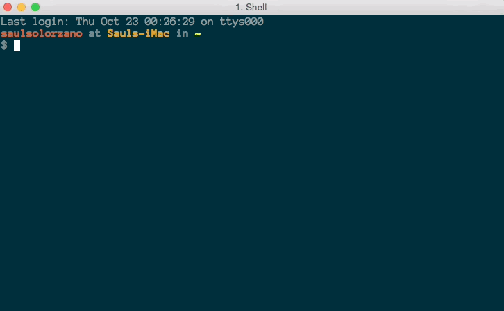
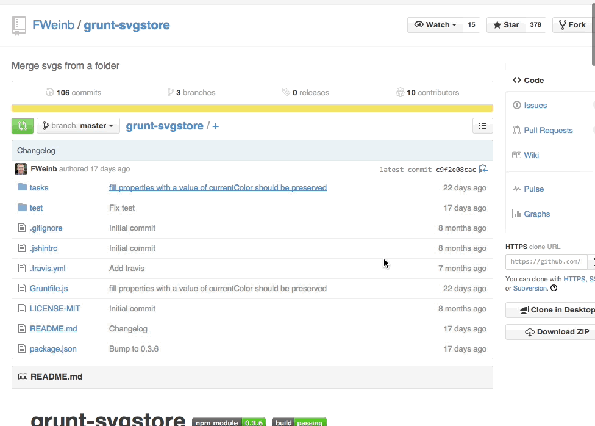
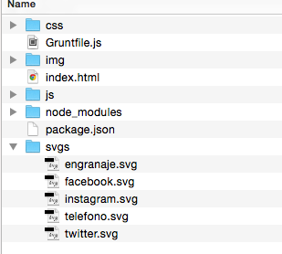
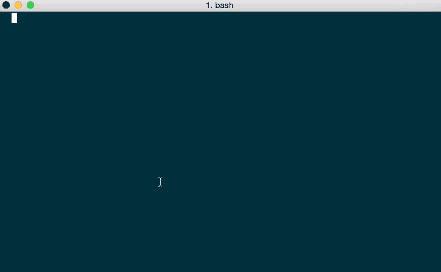
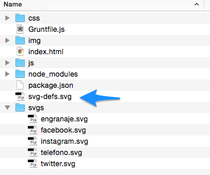

Grunt es un corredor de tareas de JavaScript. Si eres un desarrollador web front-end seguramente has visto Grunt más de una vez, pero muy probablemente nunca quisiste aprender porque pensaste que tu no necesitabas eso. Es una herramienta que se trabaja por la `consola` que es algo que el 95% de los programadores front-end evitan. Yo lo evité mucho tiempo pero una vez que me adapté al flujo de trabajo se me hace imposible desarrollar un proyecto sin Grunt integrado.  

### Automatización

La idea de grunt es automatizar tareas, aquí una lista de algunas cosas que posiblemente hagas regularmente:  
* Compilar sass, less o stylus,  
* Concadenar y minimizar tu JavaScript,  
* Generar Sprites de SVG o convertirlos en DATA URI,  
* Templates básicos de Proyectos

Así como muchas otras, prácticamente cualquier cosa que hagas regularmente se puede automatizar con Grunt. Configurar Grunt no es complicado, es un proceso sencillo y la cantidad de comandos de la consola son muy pocos.

Para usar `Grunt` necesitas tener `NodeJS` instalado, NodeJS sirve para correr JavaScript a nivel de servidor, pero no dejes que esto te intimide, necesitamos NodeJS porque NodeJS viene con NPM que es un Manejador de Paquetes y aunque no uses Grunt NPM se usa para muchas cosas web así que siempre es bueno tenerlo. Así que no te preocupes que nunca necesitarás saber NodeJS para correr grunt.

## node.js

Como dije antes para correr grunt necesitamos tener node.js instalado, hacerlo es súper sencillo, es como cualquier otra app, se descarga un paquete y se instala. Entra a la página de [node.js][1] y dale al botón gigante de **Instalar**.

## grunt-cli

Ahora necesitamos instalar Grunt-CLI, CLI (Command Line Interface) es lo que usamos para correr grunt desde el consola. Esto es lo que nos permitirá correr las tareas una vez las definamos.

Como lo dice en la [página oficial de grunt][2] lo único que necesitamos hacer es correr

```bash
npm install -g grunt-cli
```

Si da error probablemente debamos correrlo usando `sudo` para darle permiso de administrador.

## packaje.json

Todos los proyectos de Grunt necesitan un archivo llamado package.json. Es obviamente un archivo jSON donde se definen algunas cosas del proyecto y las dependencias que necesitamos, las dependencias son las tareas que vamos a correr, si necesitamos compilar `compass` instalamos la dependencia de `compass` y así vamos.
```javascript
{
  "name": "nombre-de-proyecto",
  "version": "0.1.0",
  "devDependencies": {
    "grunt": "~0.4.5",
  }
}
```

Una vez que tengamos `package.json` vamos a la carpeta del proyecto en la terminal y corremos este comando:

```bash
npm install
```

Fíjate que aquí no usamos la bandera `-g` que es **global** porque grunt funciona por cada proyecto, las dependencias que instalamos las instalamos por proyecto.




Una vez que hayamos corrido el comando vamos a ver que se creó una carpeta llamada **node_modules** donde están las dependencias, si abrimos la carpeta vamos a que hay una carpeta llamada **grunt** porque es la dependencia que instalamos.

## Usando grunt

Ahora que sabemos la configuración básica de grunt vamos a ver como funciona realmente. Necesitamos crear una tarea e instalar las dependencias que la harán funcionar. Vamos a usar como ejemplo hacer un sprite de SVGs.

Existen tareas de Grunt para casi cualquier cosa que te puedas imaginar, simplemente haz una busqueda en google y la tarea saldrá. El &#8220;plug-in&#8221; que necesitamos es [svgstore][3]

Para instalarla corremos el siguiente comando en la terminal

```bash
npm install grunt-svgstore --save-dev
```

Este comando instala svgstore y esta parte `--save-dev` se escribe para salvar la dependencia en nuestro archivo `package.json` indicando además que es una dependencia de *Desarrollo*. Una vez que el comando corra entramos en `package.json` y vamos a ver agregado de último
```javascript
"grunt-svgstore": "^0.3.6"
```

## Gruntfile.js

El siguiente paso es crear un archivo `Gruntfile.js`. Este es el archivo donde vamos a especificar todas nuestras tareas, el formato del archivo debe ser igual siempre, lo único que cambia entre proyectos son las tareas específicas de cada uno.

```javascript
module.exports = function(grunt) {

    // Configuración
    grunt.initConfig({
        pkg: grunt.file.readJSON('package.json'),

        // Aquí especificamos la tarea
        svgstore: {

        }
    });

    //Le decimos a Grunt que vamos a usar este "plug-in"
    grunt.loadNpmTasks('grunt-svgstore');

    //Estas son realmente las tareas que vamos a correr.
    grunt.registerTask('default', ['svgstore']);

};
```

No es importante entender que hace cada función dado que es poco probable que lo escribamos desde cero cada vez que lo vayamos a usar, este es un archivo que una vez que lo configuras como quieres lo colocas en tu carpeta de templates para usarlo en diferentes proyectos.

Por los momentos vemos que agarra los datos de `package.json` y así sabe que tareas tenemos creada, si llegamos a crear una tarea y no tenemos instalado el plug-in nos dará error una vez corramos `grunt` en la terminal.

Ahora vamos a modificar la tarea correspondiente a **svgstore**. Si nunca antes hemos usado un plug-in y no tenemos idea de como es la configuración básica podemos ir a la página del plug-in que siempre están en [github][4] y habrá un ejemplo explicando los pasos a seguir.



Lo ideal es tener una carpeta para los SVGs, y ahí colocamos todos los que necesitemos colocar en el sprite



Ahora vamos a crear como tal la función. Siguiendo el ejemplo que vimos en github vamos a adaptarlo un poco más a nuestras necesidades

```javascript
svgstore: {
    options: {
        prefix : "icon-",
        cleanup: true,
        svg: {
            style: "display: none;"
        }
    },
    default: {
        files: {
            "svg-sprite.svg": ["svgs/*.svg"]
        }
    }
}
```

Primero vemos las opciones y después colocamos nuestros archivos. El plug-in tiene más opciones y todas están detalladas en la documentación pero estas son las que uso siempre. Veamos una por una que significan:

  * **Prefix: &#8220;icon-&#8220;** Como el nombre lo indica, a cada icono le coloca un prefijo, en este caso &#8220;icon-&#8220;, el nombre que usaremos es el nombre del archivo de svg, es decir, si el icono se llama facebook.svg lo usaremos en nuestro código como icon-facebook, esto es bastante util por si en un futuro queremos usar css para agarrar todos los &#8220;icon-&#8221; y colocarles un estilo en específico.
  * **cleanup: true** Esa opción elimina los estilos *inline* que tenga el SVG, como `fill` que evitarán que podamos darle estilo directo en nuestra hoja de estilo.
  * **svg: { style: &#8220;display: none;&#8221; }** Esta opción nos permite colocarle un estilo *inline* al sprite, en este caso le coloco `display: none` porque el sprite debe ir incluido en todas las páginas que queramos usarlo, así evitamos que nos aparezcan muchos iconos sin estilo encima de la página.

Despues llegamos a la parte de **default** este es el nombre de la tarea dentro de la tarea, me explico: en estos momentos sólo hay una &#8220;tarea&#8221; dentro de svgstore, si usamos en la terminal `grunt svgstore` el automáticamente correrá en los archivos de la carpeta svgs, pero supongamos que por alguna razón tenemos dos carpetas separadas de svg y queremos que se exporten a dos archivos diferentes, podemos hacer esto:

```javascript
svgstore: {
    options: {
        prefix : "icon-",
        cleanup: true,
        svg: {
            style: "display: none;"
        }
    },
    social: {
        files: {
            "svg-sprite.svg": ["svgs/*.svg"]
        }
    }
    aplicacion: {
        files: {
            "svg-sprite.svg": ["svgs/*.svg"]
        }
    }
}
```

Entonces podemos correr `grunt svgstore:social` y `grunt svgstore:aplicacion` y grunt los trata diferentes, esta separación normalmente se usa es para tareas de desarrollo y tareas de producción.

Si nos fijamos en la linea de **files** vemos el formato, que se mantiene en casi todos los plugins de grunt. Primero colocamos el archivo final y después colocamos la fuente, grunt lo lee de esta manera: *Busca todos los SVG que están dentro de la carpeta svgs y haz un sprites con ellos que se llama svg-sprite*

Ahora podemos correr

```bash
grunt
```



Y como ya habíamos definido que la tarea por defecto era svgstore no necesitamos especificarlo de nuevo en la terminal. Una vez que el comando haya corrido sin error vamos a ver el archivo creado en la raíz del proyecto.



## Siguientes pasos

Grunt es extremadamente poderoso y util una vez que lo hemos configurado como lo queremos. Recomiendo ahora revisar tu flujo de trabajo y ver que tareas estás haciendo constantemente que puedan ser automatizadas con Grunt (probablemente todas) y así te salvarás mucho tiempo.

Cualquier duda o comentario que tengas no dudes en escribir un comentario.

 [1]: http://nodejs.org/
 [2]: http://gruntjs.com/getting-started#installing-the-cli
 [3]: https://github.com/FWeinb/grunt-svgstore
 [4]: https://github.com/