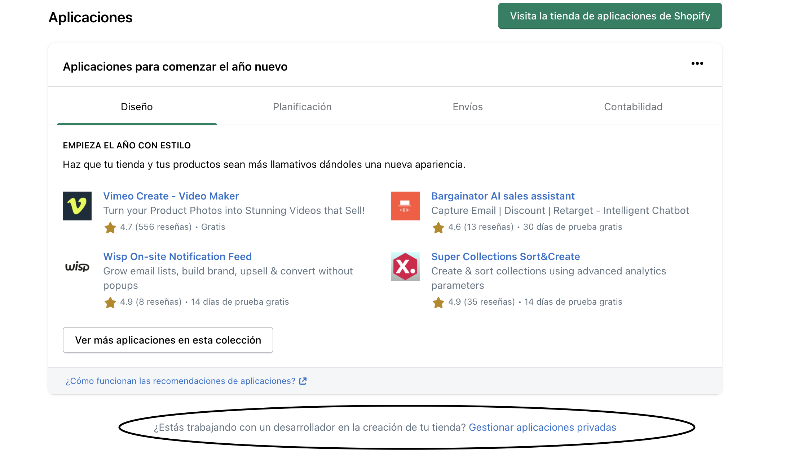
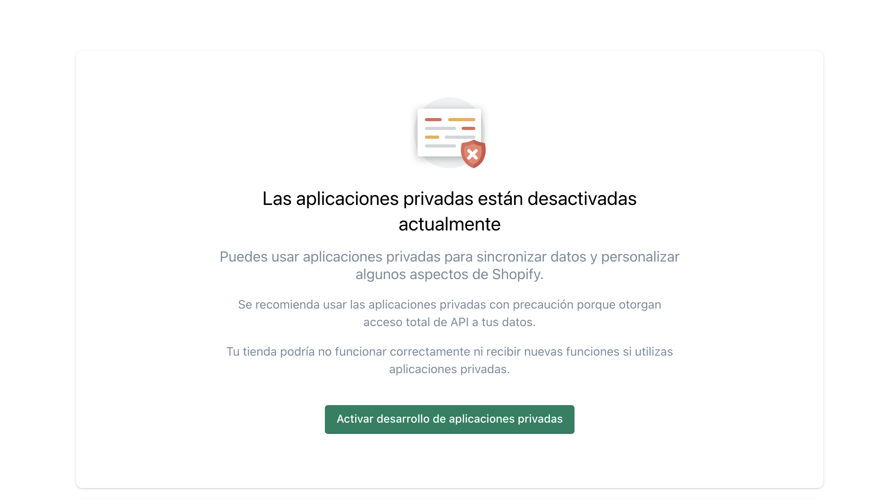
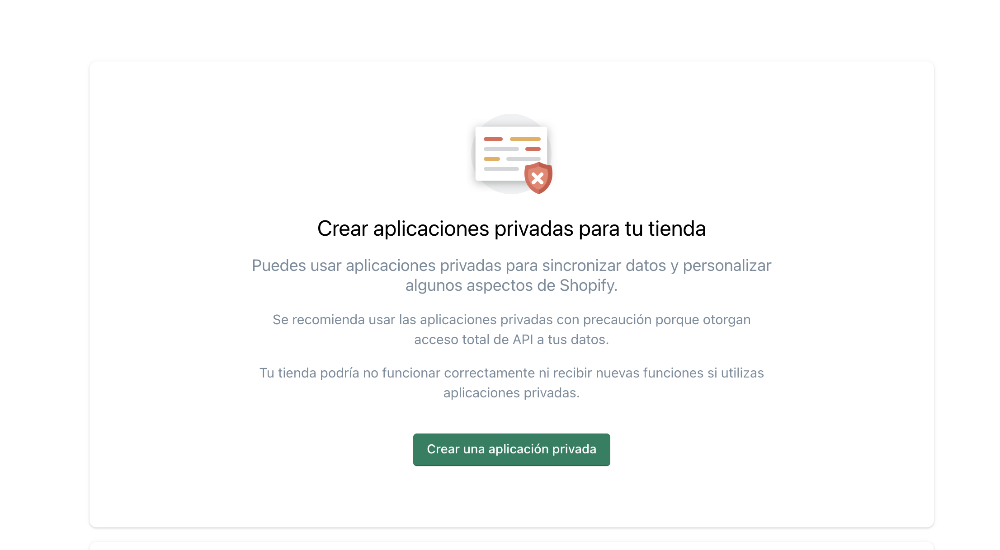
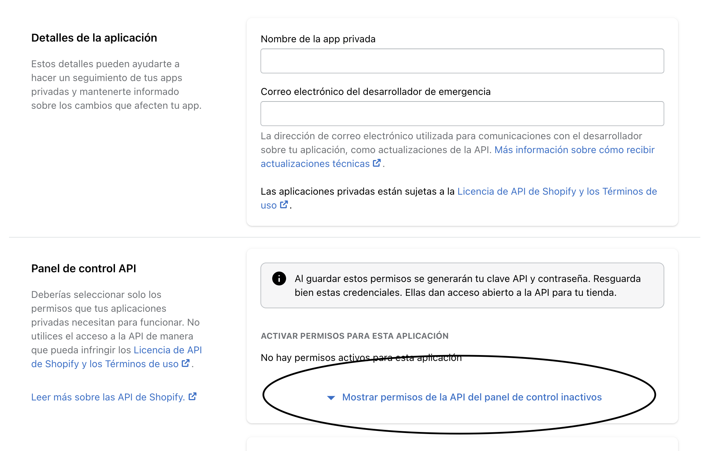
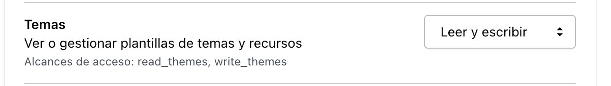
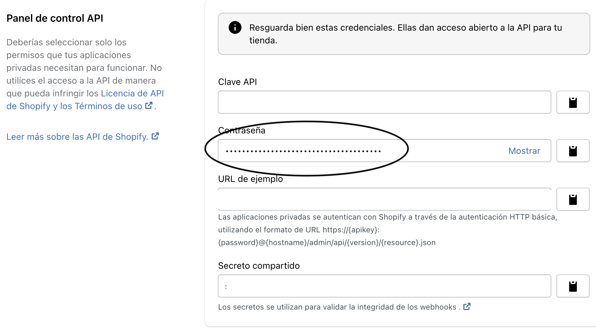
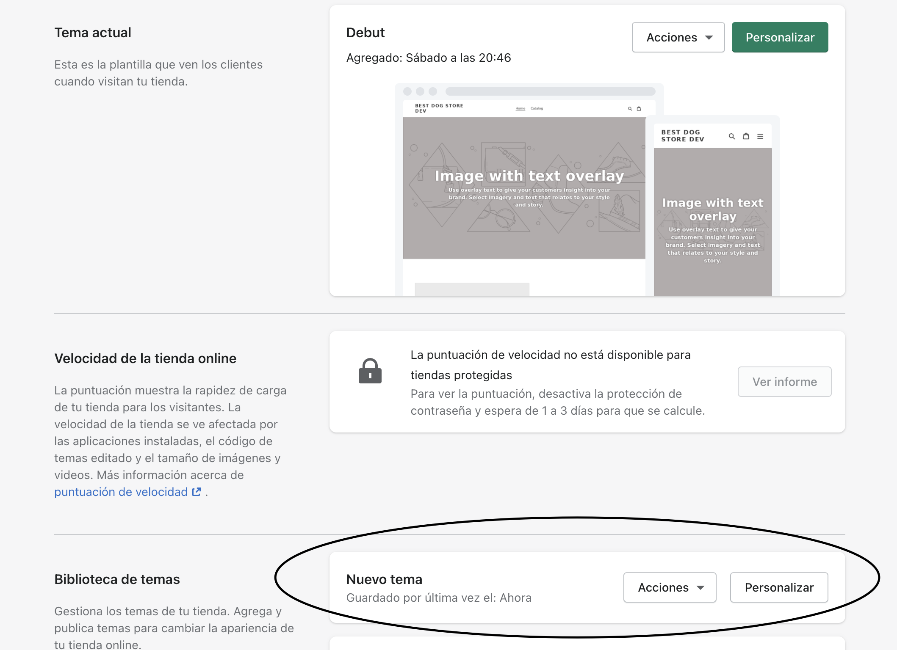

<div class="bg-gray-100 w-10/12 m-auto border series-index dark:bg-gray-800 dark:border-gray-700">
	<span class="font-bold m-0 py-1 px-5 block text-blue-700 dark:text-blue-500">Desarrollo de temas con Shopify</span>
	<span class="block m-0 py-1 px-5 border-t border-gray-300 font-bold dark:border-gray-600"><a href="/recomendaciones-trabajo-con-shopify">1. Recomendaciones para trabajar con temas de Shopify</a></span>
	<span class="block m-0 py-1 px-5 border-t border-gray-300 font-bold dark:border-gray-600"><a href="/instalando-theme-kit" class="current">2. Instalando Theme Kit</a></span>
	<span class="block m-0 py-1 px-5 border-t border-gray-300 font-bold dark:border-gray-600"><a href="/creando-certificado-seguridad-local">3. Creando certificado de seguridad local</a></span>
	<span class="block m-0 py-1 px-5 border-t border-gray-300 font-bold dark:border-gray-600"><a href="/desarrollo-local-shopify-con-themekit-gulp">4. Usando Gulp para desarrollo local con Shopify</a></span>
</div>

TL;DR: Haz click <a href="https://shopify.github.io/themekit/" target="_blank">acá</a> para seguir las instrucciones y leer toda la documentación. Si usas Mac OS y usas <a href="https://brew.sh/" target="_blank">homebrew</a> aquí están las instrucciones:
```bash
brew tap shopify/shopify
brew install themekit
```

***

#### Un poco de historia primero

Empezando el 2019 Shopify recomendaba usar <a href="https://shopify.github.io/slate/docs/about" target="_blank">Slate</a>, y a pesar de no ser una herramienta perfecta, hacía el trabajo local muy cómodo, es el equivalente a un `npm start` con create-react-app o `gatsby develop`. El problema es que en marzo de 2019 Slate entró en modo de "poco mantenimiento" diciendo que se tomarían 6 meses para evaluarlo y finalmente en enero de 2020 declararon que no iban a soportar más Slate.

Así que la recomendación oficial de Shopify es usar <a href="https://shopify.github.io/themekit/" target="_blank">Theme Kit</a>, Slate realmente estaba construido encima de Theme Kit. El problema es que Theme Kit es muy diferente a Slate. Mientras Slate permite una experiencia de desarrollo sin prácticamente ninguna configuración, Theme Kit solo permite funciones básicas del tema, y a pesar de que tiene un comando de `watch` este sólo revisa que algún archivo se haya actualizado y lo sube a los servidores de Shopify, pero no compila, no transpila ni nada parecido, todo eso queda de parte de uno para implementar usando Webpack, Gulp o Grunt.

La idea de esta serie de posts es documentar un poco el proceso de creación de ese ambiente de desarrollo.

## Instalación

Lo primero que debes hacer es <a href="https://shopify.github.io/themekit/#installation" target="_blank">instalarlo</a>, Theme Kit está disponible para todas las versiones de sistemas operativos. Acá dejo las instrucciones para MacOS

```bash
brew tap shopify/shopify
brew install themekit
```
De todas formas recomiendo revisar la documentación por si esto ha cambiado desde que se escribió este artículo, si usas otro sistema operativo encontrarás las instrucciones en el link anterior.

## Config.yml

Theme kit usa un archivo llamado `config.yml` para la configuración de la tienda y el tema con el cual se está trabajando. Este archivo tiene la siguiente estructura:

```yaml
development:
  password: 16ef663594568325d64408ebcdeef528
  theme_id: "123"
  store: can-i-buy-a-feeling.myshopify.com
  proxy: http://localhost:3000
  ignore_files:
    - "*.gif"
    - "*.jpg"
    - config/settings_data.json
```

Nos fijamos el título `development`. En el mismo archivo debemos tener todos nuestros ambientes de desarrollo y el nombre es una decisión personal o de equipo. Es decir, podríamos tener un archivo que se viera así:

```yaml
development:
  password: 16ef663594568325d64408ebcdeef528
  theme_id: "123"
  store: my-dev-store.myshopify.com
  ignore_files:
	- config/settings_data.json

production:
  password: 16ef23423423425d64408ebcdeef125
  theme_id: "456"
  store: my-store.myshopify.com
  ignore_files:
    - config/settings_data.json
```

Como podrán ver, este archivo usa el formato YAML. YAML es bastante delicado, hay que respetar la indentación y el uso de los espacios, sino el archivo no funcionará.

**Importante: Dado que este archivo tiene una clave de acceso a nuestro tema por API la decisión de versionarlo o no es algo que se tendrá que decidir como equipo**

### ¿De dónde saco esa clave?
Shopify da la opción de crear aplicaciones de uso privado. Para crear una debes ir a la ventana de Aplicaciones y debajo del listado de aplicaciones vas a ver un texto que es muy fácil de perder.

> ¿Estás trabajando con un desarrollador en la creación de tu tienda? Gestionar aplicaciones privadas



Si es primera vez que se crean aplicaciones privadas en tu tienda, solo el dueño de la tienda tiene el permiso de crearlas. Esta pantalla se verá solo una vez por el tiempo de vida de la tienda.



Hay que aceptar los términos y condiciones para poder activar el desarrollo.



Se nos presentrá una pantalla para darle nombre a la aplicación y agregar nuestro correo:



Acá es importante darle clic donde dice "**Mostrar permisos de la API del panel de control inactivos**".

Como el nombre lo dice, esto desplegará todos los posibles permisos que puede tener la API. Esta parte es delicada.

<div style="width:100%;height:0;padding-bottom:56%;position:relative;"><iframe src="https://giphy.com/embed/giLHkdUIBi3qQ3pJEp" width="100%" height="100%" style="position:absolute" frameBorder="0" class="giphy-embed" allowFullScreen></iframe></div><p><a href="https://giphy.com/gifs/neurads-omg-app-yolanda-giLHkdUIBi3qQ3pJEp">via GIPHY</a></p>

En mi opinión, lo mejor es que esta Aplicación solo tenga permiso para gestionar los Temas, ya que Theme Kit realmente no se necesita nada más, si en un momento se llega a necesitar más permisos para otra cosa, lo mejor es crear otra app con los permisos adecuados. 



Hay que buscar en la lista de permisos, que es bastante larga, y seleccionar sólo la de Temas y el permiso debe ser **Leer y escribir**

Una vez que creemos la aplicación vamos a ver una sección nueva con la "Clave API (API KEY)" y la "**Contraseña (Password)**"



Esta última es la que debemos usar para nuestro `config.yml`.

## Primeros pasos

Si nunca has creado un tema de Shopify, lo mejor es usar el comando `new` para crear un nuevo tema, la ventaja es que lo crea localmente y lo sube automáticamente a Shopify. Este comando crea todos los archivos necesarios para un tema de Shopify, con liquid bastante básico, un archivo `config.yml`, nada de Javascript y nada de SCSS. Perfecto para desarrollar.

```bash
theme new --password=[CLAVE] --store=[tu-tienda.myshopify.com] --name="Nuevo Tema"
```

Si corremos este comando en una carpeta nueva y vacía veremos algo como esto

```bash
[tu-tienda.myshopify.com] theme created
[tu-tienda.myshopify.com] config created
Created assets.
	Created assets/application.js.
	Created assets/application.scss.liquid.
Created config.
	Created config/settings_data.json.
	Created config/settings_schema.json.
Created layout.
	Created layout/theme.liquid.
Created locales.
	Created locales/en.default.json.
Created templates.
	Created templates/cart.liquid.
	Created templates/gift_card.liquid.
	Created templates/index.liquid.
	Created templates/404.liquid.
	Created templates/article.liquid.
	Created templates/blog.liquid.
	Created templates/page.contact.liquid.
	Created templates/page.liquid.
	Created templates/product.liquid.
	Created templates/search.liquid.
	Created templates/collection.liquid.
	Created templates/collection.list.liquid.
	Created templates/list-collections.liquid.
Created templates/customers.
	Created templates/customers/addresses.liquid.
	Created templates/customers/login.liquid.
	Created templates/customers/order.liquid.
	Created templates/customers/register.liquid.
	Created templates/customers/reset_password.liquid.
	Created templates/customers/account.liquid.
	Created templates/customers/activate_account.liquid.
[tu-tienda.myshopify.com] uploading new files to shopify
[development] 26|26 [==============================================================================]  100 %
```

Y si vamos a nuestra tienda, en la sección de Tienda Online vamos a ver nuestro nuevo Tema al final, dándole click en "Acciones" y "Publicar" podremos verlo en vivo.




## Uso de ambientes
Como vimos anteriormente, podremos utilizar nuestro `config.yml` para tener varias tiendas o incluso varios temas dentro de la misma tienda. El ambiente por defecto para Theme kit es `development`, si revisamos el archivo `config.yml` que se generó con nuestro comando anterior vemos la versión más básica del mismo, y vemos que el nombre de este ambiente es "developement"

```bash
development:
  password: 1342132424
  theme_id: "w34r354435"
  store: tu-tienda.myshopify.com
```

En caso de querer cambiar ese nombre, o si tienes varios ambientes de desarrollo, debes usar la bandera `--env` o `-e` para pasar el ambiente. Por ejemplo

```bash
theme watch --env=prod
```

## Temas en vivo
Desde hace algunas versiones atrás, si estás trabajando con un tema que esté en "vivo", ya sea en una tienda de desarrollo o en la tienda de producción, hay que pasar la bandera `--allow-live` para que el código se suba sin problema.

## Deploy y Watch
Los comandos que más se usarán, por mucho, son `watch` y `deploy`. Cada uno con esta estructura

```bash
theme watch --env=[Ambiente]
theme deploy --env=[Ambiente]
```

### Watch
Este comando es bastante básico, una vez que lo activemos el feedback es el siguiente:

```bash
→ theme watch --allow-live
00:00:00 [development] Nombre de Tienda: Watching for file changes to theme 118508290222
00:00:01 [development] processing templates/index.liquid
00:00:05 [development] Updated templates/index.liquid
```
Acá vemos el proceso del watcher iniciado, cuando cuando se hace un cambio algún archivo del tema, el watcher detecta el cambio y lo subo a Shopify.

Como lo comenté anteriormente, el watcher solo se encarga de ver si algún archivo cambió y lo sube. Nada más. No refresca navegador, no compila estilos ni traspila JavaScript, todo eso debemos [hacerlo nosotros](/desarrollo-local-shopify-con-themekit-gulp)

#### Notify

Este comando tiene una posible bandera `--notify` la cual se usa como un webhook para notificar a Theme Kit del cambio de un archivo, usaremos esta bandera para conectarlo con el browserSync en nuestro Gulpfile

```bash
theme watch --env=[Ambiente] --notify=/var/tmp/theme_ready
```

### Deploy
Este comando se encarga de subir nuestro código a Shopify.

***

Esta es la segunda parte de esta serie, en la siguiente parte veremos como instalar un certificado de seguridad local y después configuración de Gulp.
