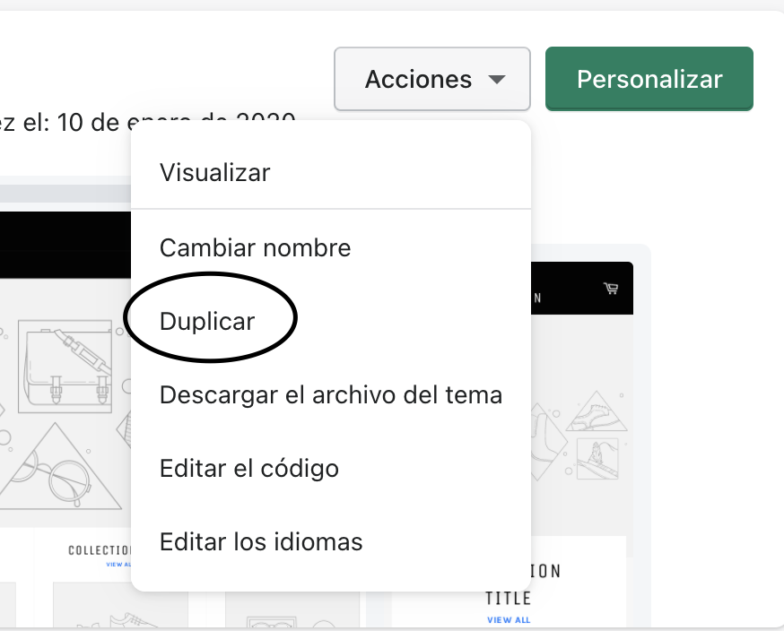

**Parte I** de la serie de como trabajar con temas de Shopify localmente

Lo primero que debemos saber es que realmente es imposible trabajar 100% local con Shopify, ya que nunca se puede "instalar" Shopify localmente. Esto es muy diferente a trabajar con otras herramientas como Laravel, Wordpress o algún framework de JavaScript. 

Cuando empecé a escribir este artículo me di cuenta que iba a ser demasiado largo, así que decidí dividirlo en varias partes para no hacerlo tan pesado y que cada artículo tuviese su propósito.

#### Indice

1. Recomendaciones para trabajar con temas de Shopify (Este)
2. [Instalando Theme Kit](/instalando-theme-kit)
3. [Creando certificado de seguridad local](#)
4. [Configurando Gulp para trabajar con Theme Kit](#)

## 1. Instalar Theme Kit

La manera más cómoda de trabajar con Shopify es usando Theme Kit. Esto te permitirá tener tu tema local y versionado con github y al mismo tiempo sincronizado con los servidores de Shopify. Shopify solía mantener una herramienta construída encima de Theme Kit llamada Slate, pero empezando el 2020 decidieron descontinuarla porque se querían "enfocar" en otras prioridades. 

La ventaja que tenía Slate es que tenía un ambiente completo de desarrollo. Con linters, watchers y todo incluído. Una vez que Slate fue descontinuado, tuve que crear toda la funcionalidad, bueno casi toda, usando Gulp.

## 2. Crea una cuenta en Shopify Partners
Hay tres maneras de trabajar con un tema de Shopify:

#### Trabajar con el tema en vivo
Debería ser obvio porque es una mala idea, si haces algún cambio se va a ver directamente reflejado a todos los usuarios de tu sitio.

#### Trabajar con un tema duplicado en la tienda principal
Esta es realmente la más cómoda pero no la más flexible, es la más cómoda porque tienes todos los productos, menús de navegación y tema ya configurado, solo debes duplicar el tema que está en vivo y podrás trabajar con este. 

¿Porqué digo que no es la opción más flexible? Porque si necesitas cambiar templates, precios de productos o cualquier otra cosa que no sea del tema, sino de Shopify como tal, no podrás porque eso afectará al sitio que esta en vivo.

#### Crearse una cuenta en Shopify Partners y crear tiendas de prueba.

La mejor opción, pero a que toma un poco más de tiempo, es crearse una cuenta en [Shopify Partners](https://www.shopify.com/partners)

¿Porqué Shopify Partners y no una tienda nueva normal? Porque la tiendas reales tienen un máximo de 14 días de pruebas antes de que tengas que pagarla, cuando creas una tienda con Shopify Partners tienes la opción de hacer una tienda solo de prueba que tendrá todas las opciones de una tienda Avanzada y no tiene límite de tiempo.

## 3. Configura tu tienda nueva como la anterior
Tristemente no existe una opción de "exportar tienda" o algo parecido. Hay cosas que sí puedes exportar, lo más cómodo es la habilidad de exportar los productos, pero hay ciertas cosas que no se pueden exportar como los menús de navegación. Un consejo que daría es exportar el archivo `settings_data.json` del tema que está en producción. No se exportarán las imágenes del tema ni los menús de navegación pero tendrás la tienda lo más parecido que se puede hacer.
