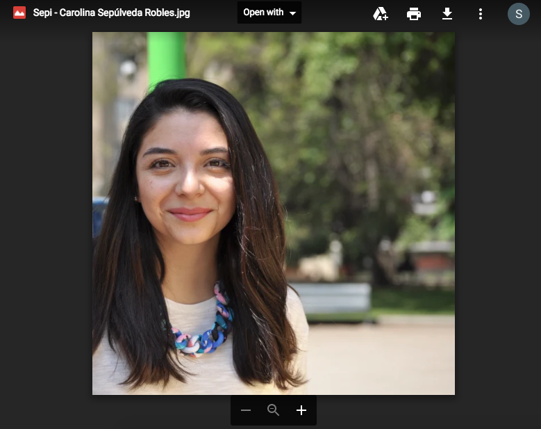

Hace unos días conté como decidí ayudar a las chicas de <a href="https://medium.com/@saulsolorzano/mas-mujeres-en-ux-y-la-importancia-de-la-colaboraci%C3%B3n-entre-%C3%A1reas-c221b6786719" target="_blank">Mas Mujeres UX</a> con su sitio web.

Ellas tienen un formulario de Google Forms, que la verdad son muy buenos y sacan la pata del barro cuando es necesario (ayuda en momentos de crisis, para los no fluídos en #venezueling). Estamos en proceso de cambiar ese formulario también.

Los datos de este formulario se pasan a un spreadsheet de Google Docs, súper cómodo para trabajar. Pero con el **directorio** en camino, había que exportar esos datos a una base de datos, para esta primera versión del directorio estamos usando `MySQL`, la vieja confiable.

Google permite exportar el spreadsheet como un archivo `.csv` e importar esto a una tabla de `MySQL` es muy sencillo. 

Yo trabajo con Mac y uso [Sequel Pro](https://www.sequelpro.com/) para manejar mis bases de datos localmente, incluso tiene la opción para conectarse por SSH y muchas veces me conecto a los servidores por ahí, de verdad es súper cómoda la app.

El punto es que Sequel Pro me deja importar el `.csv`, lo único que tenía que hacer era crear la tabla con los campos necesarios, asignar nuestras filas de datos y Sequel Pro lo importa sin problema.

### Not so fast kid!!!

Todo muy divertido hasta ahora, pero el formulario daba la opción para que las mujeres subieran su foto y Google simplemente coloca un link a la ruta donde están en Google Drive.

#### Soluciones no inteligentes/flojas
Obviamente primero traté de hacer lo más fácil, hacer un curl al link y descargar la imagen, el problema es que el link que Google coloca no es directo a la imagen, Google no da esos links, sino da un link con toda la interfaz de ellos y ahí es que te da la opción de descargarlo.



Después ser testarudo por 20 min, entendí que no se podía hacer así, entonces busqué la API de Google, específicamente, la [librería de PHP](https://github.com/google/google-api-php-client) para poder usar la API de Google, sí, estamos usando también `PHP` para esta primera versión del directorio.

Hay que crear una nueva aplicación en google, y solicitar permisos, nada del otro mundo.

Google recomienda instalar la librería con [composer](https://getcomposer.org/) como es el estandard, así que corremos:

```bash
composer require google/apiclient:^2.0
```

Lo primero es hacer la prueba conectándonos, creamos un archivo `index.php` y colocamos nuestro código.


```php
<?php
// Debemos hacer primero la carga de autoload.php
require_once 'vendor/autoload.php';

// Código para conectarse con google
$client = new Google_Client();
$client->setApplicationName({{NOMBRE_DE_APLICACION}});
$client->setDeveloperKey({{LLAVE}});
$service = new Google_Service_Drive($client);
```


Si colocamos nuestra info bien no deberíamos tener ningún error. Ahora necesitamos pasarle el ID de nuestro recurso para que la API pueda trabajar.


```php
<?php
$fileId = {{ID}};
$response = $service->files->get($fileId, array('alt' => 'media'));
```


El `'alt' => 'media'` es necesario porque estamos trabajando con imágenes.

Nuestro `$response` será un objeto gigante, con dos métodos (¿Capaz más? Nunca lo sabrémos) `getHeaders()` y `getBody()`.

> Protip: Cuando estén trabajando con algo que no conocen, `var_dump` es su mejor amigo, yo le hago `var_dump` a todo para ver que me regresa y si me sirve para trabajar, recordemos que
> 
> 

Todo bien, pero ¿cómo salvar eso a un archivo?, después de buscar mucho e intentar diferentes métodos, encontré [uno](https://stackoverflow.com/questions/40028169/google-drive-api-v3-downloading-files-in-php) que me funcionó.

```php
<?php
//Gracias a https://stackoverflow.com/questions/40028169/google-drive-api-v3-downloading-files-in-php
$outHandle = fopen(UPLOAD_DIR.'/imagen.jpg', "w+");

while (!$response->getBody()->eof()) {
    fwrite($outHandle, $response->getBody()->read(1024));
}

fclose($outHandle);
```
***Aquí hacemos referencia a una defición `UPLOAD_DIR`, la cual recomiendo hacer con nuestra ruta de la carpeta donde van las imágenes, porque usaremos esa ruta bastante***

Hasta que lleguemos al final del archivo (end-of-file - EOF) leemos 1024 bytes cada vez y escribimos la salida en el archivo.

Después de correr el script completo deberíamos tener un archivo en nuestro directorio llamado `imagen.jpg` con nuestra imagen, pero ahora tenemos varios problemas, el principal es que no todos nuestros archivos se pueden llamar `imagen.jpg`, lo ideal sería que el archivo se llamara como cada miembro del directorio, bueno realmente se puede llamar como queramos, con tal de que salvemos la referencia donde corresponde en la base de datos.

Lo otro es que como dije anteriormente, dentro de nuestros datos tenemos el link, no el ID solamente, lo bueno es que nuestros links tienen todos esta estructura `https://drive.google.com/open?id=1nSI9mMZF3xmdrYyyOfIHY0-ae7CQsO7c` así que ahí mismo dentro de la URL está el **ID** que nos interesa. Lo otro es que no todas las imágenes son **jpg**, hay seguro algunas **png**, espero ninguna **gif**, el peor formato para una imagen para un directorio pero uno nunca sabe.

Adicionalmente a esto, las fotos del directorio deben ser 400x400 y en blanco y negro. Aparte de esto, sería bueno generar una [versión de 10x10 pixeles y generarle un blur para hacer lazy loading]*Nota a mi: escribir artículo* de las imágenes. 

Así que tenemos que seguir los siguientes pasos
1. Conectarnos a la base de datos para trabajar directamente con los datos.
2. Crear un nombre para los archivos.
3. Sacar todos los ID de los links.
4. Generar funciones para descargar las imágenes de google usando el código que vimos arriba.
5. Verificar el tipo de archivo para generarlo como corresponde.
6. Descargar imágenes
7. Cortar y editar las imágenes
8. Guardar referencia en la base de datos
9. [Profit](https://media.giphy.com/media/g8S1ntWFumtmE/giphy.gif)

Sé que son muchos pasos pero no es tan complicado como parece. Así que vamos a programar.
<br/>

<div style="width:100%;height:0;padding-bottom:56%;position:relative;"><iframe src="https://giphy.com/embed/3og0ITQOC5wlyk8ffy" width="100%" height="100%" style="position:absolute" frameBorder="0" class="giphy-embed" allowFullScreen></iframe></div><p><a href="https://giphy.com/gifs/siliconvalleyhbo-silicon-valley-kumail-nanjiani-3og0ITQOC5wlyk8ffy">via GIPHY</a></p>

### 1. Conexión a la base de datos

Como nombré anteriormente, vamos a usar PHP y MySQL para nuestro proyecto. Entonces vamos a usar [PDO](http://php.net/manual/en/ref.pdo-mysql.php) para conectarnos con nuestro MySQL.

Por comodidad vamos a trabajar con clases.


```php
<?php
// Definimos primero lo que necesitamos para conectarnos
// a la base de datos
define('DB_HOST', 'localhost');
define('DB_USER', '{{USUARIO}}');
define('DB_NAME', '{{NOMBRE}}');
define('DB_PASSWORD', '{{CLAVE}}');

class DBHandler {
    private $db;
    function __construct() {
        $this->connect_database();
    }
    // Esta función es la que usaremos para interactuar con nuestra base de datos
    public function getInstance() {
        return $this->db;
    }

    private function connect_database() {
        try {
            $connection_string = 'mysql:host='.DB_HOST.';charset=utf8;dbname='.DB_NAME;
            $connection_array = array(
                PDO::ATTR_ERRMODE => PDO::ERRMODE_EXCEPTION,
                PDO::ATTR_DEFAULT_FETCH_MODE => PDO::FETCH_ASSOC
            );

            $this->db = new PDO($connection_string, DB_USER, DB_PASSWORD, $connection_array);
        }
        catch(PDOException $e) {
            echo 'ERROR: ' . $e->getMessage();
        }
    }
}
```


Ya tenemos nuestra conexión a la base de datos. Para tener todo ordenado es buena idea tener nuestras credenciales en su archivo por separado, y esta función en otro archivo, `class.db.php` puede ser.

Entonces lo ideal es hacer un loop por toda nuestra base de datos, correr todo el código necesario, y después insertar las referencias a las imágenes en nuestra tabla.

Necesitamos una función que nos traiga todos los datos de nuestra base de datos, así que en otro archivo `class.users.php` vamos a crear una clase nueva extendiendo la funcionalidad de la que creamos anteriormente.

```php
<?php
// Nuestra nueva clase `USER` extiende la funcionalidad de DBHandler
class User extends DBHandler {
    // Declaramos nuestra tabla arriba, para no tener que estar cambiandola
    // en cada función
    public $table = 'directorio';
    //...
    // Aquí van otras funciones del directorio
    //...

    /**
     * Función para traernos todos los datos de una tabla
     * @return array todos los datos
     */
    public function getAllData() {
        $stmt = $this->getInstance()->prepare('SELECT * FROM '.$this->table);
        $stmt->execute();

        $result = $stmt->fetchAll();

        return $result;
    }
}
```

Una vez que corramos getAllData() nos vamos a traer todos los datos.

Ahora nos podemos ir a nuestro `index.php` y llamar a nuestros dos archivos

```php
<?php
require_once('class.db.php');
require_once('class.users.php');

// Nueva instancia de nuestra clase
$usuarios = new User();

// Aquí corremos nuestra función y guardamos los datos en la 
// variable `$data`
$data = $usuarios->getAllData();

// Como nuestra $data es un array, podemos correr un foreach
foreach ($data as $member) {
    // Recuerden, siempre `var_dump` a todo para verificar
    var_dump($member);
}
```

Si entramos a nuestro `index.phpz vamos a ver muchos datos. Pero eso significa que funciona nuestro código.

### Crear un nombre para los archivos

Ya que tenemos el nombre de las mujeres en nuestra base de datos, podemos usarlo para el nombre de archivo. Lo que debemos hacer es limpiar el nombre, eliminar caractéres especiales, todo en minúscula y reemplazar espacios por el dash (`-`). Para eso podemos crear una función sencilla:

```php
<?php
function clean($string) {
    // Reemplaza todos los espacios por el dash
    // y convierte el nombre en minúscula
    $string = str_replace(' ', '-', strtolower($string));
    // Con preg_replace usamos una expresión regular
    // para eliminar todos los caracteres que no
    // sean letras y números normales.
    return preg_replace('/[^A-Za-z0-9\-]/', '', $string);
}
```

Entonces dentro de nuestro `foreach` podemos tener el siguiente código:

```php
<?php
foreach ($data as $member) {
    // name es el nombre de la columna de MySQL
    $filename = clean($member['name']);
    // Para probar que nuestro código funcione, ya saben
    var_dump($filename);
}
```

Entonces por ejemplo el nombre **Carolina Sepúlveda Robles** será `carolina-seplveda-robles`, perfecto.

### Sacar todos los ID de los links.

Ahora necesitamos sacar el ID, fácil, como sabemos el ID está dentro de la dirección que nos da Google, además, como todas las direcciones son iguales podemos correr un código sencillo, es tan sencillo que ni lo colocaremos en una función, sabemos que solo tenemos un signo de igual **=** en nuestra URL entonces podemos usar la función `explode` para separar nuestro string por ese signo.

```php
<?php
foreach ($data as $member) {
    // name es el nombre de la columna de MySQL
    $filename = clean($member['name']);
    // Para probar que nuestro código funcione, ya saben
    
    $videoExploted = explode('=', $member['picture']);
    // Cuando es mucha data es bueno colocar
    // envolver nuestro var_dump en un <pre>
    // y así podemos ver todo mucho más claro
    echo '<pre>';
    var_dump($videoExploted);
    echo '</pre>';
}
```

Deberíamos tener muchos de estos:
```php
<?php
array(2) {
  [0]=>
  string(32) "https://drive.google.com/open?id"
  [1]=>
  string(33) "1c6Iospo_Rl0WjI3WwQ2LaScKa57KYsHY"
}
```

Como ven, lo que nos interesa está en el segundo indice de nuestro array. Así que podemos modifcar el código de esta manera

```php
<?php
foreach ($data as $member) {
    // name es el nombre de la columna de MySQL
    $filename = clean($member['name']);
    
    // Lo sé, no es la solución más elegante pero
    // solo lo usaremos esta vez.
    $videoExploted = explode('=', $member['picture']);
    $videoId = $videoExploted[1];
}
```

Ahora nuestra variable `$videoId` tiene el ID de cada uno de nuestros videos. Vamos más cerca.

### Generar funciones para descargar las imágenes de google usando el código que vimos arriba.

Vamos a unir el código de Google que creamos arriba dentro de nuestro `forEach` que cada minuto crece más.

Primero vamos a crear una función sencilla a la cual le pasaremos nuestro objecto de Google y el ID de la foto para traernos la información necesaria

```php
<?php
/**
 * Función para traernos nuestro archivo
 * @param  object $service el llamado a google
 * @param  string $id      ID completo de nuestro archivo
 * @return object          nuestro archivo
 */
function getFile($service, $id) {
    // $service la creamos arriba, es la nueva
    // instancia de nuestro llamado a google,
    // aquí pasamos el ID
    return $service->files->get($id, array('alt' => 'media'));
}
/**
 * Creamos el archivo
 * @param  object $response llamado de google
 * @param  string $fullName nombre que le colocaremos a nuestro archivo
 */
function createFile($response, $fullName) {
    // Aquí es mejor usar rutas absolutas
    // primero usamos la función fopen como le
    // colocamos 'w+' en nuestro segundo parámetro,
    // escribir y leer php creará el archivo, ya que no existe
    $outHandle = fopen(UPLOAD_DIR . $fullName, "w+");
    // Hacemos el loop por nuestra respuesta,
    // recuerden, 1024 bytes cada vez
    while (!$response->getBody()->eof()) {
        fwrite($outHandle, $response->getBody()->read(1024));
    }
    // Cerramos el proceso
    fclose($outHandle);
}

```

### Verificar el tipo de archivo para generarlo como corresponde.

Ahora necesitamos saber que tipo de archivo es. Si recordamos, cuando hacemos el llamado a la API de google, uno de los métodos, el `getHeaders()` nos da la información del archivo que estamos accediendo, dentro de las cosas que trae nos dice el [Content-Type](https://developer.mozilla.org/en-US/docs/Web/HTTP/Headers/Content-Type). Podemos crear una función para que basado en el content type, generemos la extensión que necesitamos.

Lo primero es guardar nuestro `Content Type` en una variable para poder referenciarlo, este código va dentro de nuestro `foreach`

```php
<?php
foreach ($data as $member) {
    // name es el nombre de la columna de MySQL
    $filename = clean($member['name']);
    
    // Lo sé, no es la solución más elegante pero
    // solo lo usaremos esta vez.
    $videoExploted = explode('=', $member['picture']);
    $videoId = $videoExploted[1];

    // Nuestra función creada anteriormente
    $response = getFile($service, $videoId);

    // Llamamos a getHeaders() y pasamos lo que buscamos
    $ct = $response->getHeaders()['Content-Type'][0];
    // Función que no hemos creado aún.
    $ext = getFileExtension($ct);
}
```

Ahora necesitamos escribir nuestra función `getFileExtension()`, como sabemos que son imágenes, y son solo tres formatos de imagen que debemos preocuparnos podemos escribir una función bien sencilla.

```php
<?php
/**
 * Usamos esta función para determinar la extensión de nuestro archivo
 * @param  string $contentType de cada archivo
 * @return string              nuestra extensión
 */
function getFileExtension($contentType) {
    switch ($contentType) {
        case 'image/gif':
            $ext = '.gif';
            break;
        case 'image/jpeg':
            $ext = '.jpg';
            break;
        case 'image/png':
            $ext = '.png';
            break;
    }
    return $ext;
}
```

### Descargar imágenes

Ok ya no nos falta mucho, ahora debemos descargar las imágenes, la función ya la creamos en uno de nuestros pasos anteriores. 

```php
<?php
foreach ($data as $member) {
    // name es el nombre de la columna de MySQL
    $filename = clean($member['name']);

    // Lo sé, no es la solución más elegante pero
    // solo lo usaremos esta vez.
    $videoExploted = explode('=', $member['picture']);
    $videoId = $videoExploted[1];

    // Nuestra función creada anteriormente
    $response = getFile($service, $videoId);

    // Llamamos a getHeaders() y pasamos lo que buscamos
    $ct = $response->getHeaders()['Content-Type'][0];
    // Función que no hemos creado aún
    $ext = getFileExtension($ct);

    //Creamos el nombre completo del archivo
    //con nuestro nombre limpio y la extensión
    $fullFileName = $filename . $ext;

    //Nombre del archivo blanco y negro
    $fileByW = $filename . '-byn' . $ext;
    // Nombre del archivo pequeño
    $fileTiny = $filename . '-tiny' . $ext;

    createFile($response, $FullFileName);
}
```

La función tardará en correr un rato, dependiendo de cuantos archivos tengamos que descargar y del tamaño del mismo, aquí estamos descargando las fotos en su tamaño original, así que si varias personas subieron imágenes de 4mb el código tardará en correr. Una vez termine deberíamos tener en nuestra carpeta todas las imágenes con el nombre que le colocamos y su extensión correspondiente. Excelente hasta ahora.

### Cortar y editar las imágenes

Para cortar las imágenes usaremos la [librería Image-resize de Gumlet](https://github.com/gumlet/php-image-resize), es muy cómoda de usar y funciona excelentemente.

Como ya usamos [composer](https://getcomposer.org/) corremos el comando
```bash
composer require gumlet/php-image-resize:1.8
```
Para instalar la última versión en el momento de escribir este artículo.

Como ya llamamos al archivo `autoload.php` en el tope de nuestro index.php tenemos acceso a nuestra librería.

Ahora vamos a crear nuestra función, es bien larga porque debe hacer varias cosas así que vamos por parte y después unimos todo. Pero la idea es que podamos llamarla así `editImage(imagen, nombre_byn, nombre_peque, tipo)`

Lo primero que debemos hacer es crear una nueva instancia de nuestro objecto, como dice en la documentación ([nunca no se olviden de leer la documentación](https://media.giphy.com/media/d3mlE7uhX8KFgEmY/source.gif)), esta clase usa [namespacing](http://php.net/manual/en/language.namespaces.php) debemos hacer el llamado de esta manera.

```php
<?php
$image = new \Gumlet\ImageResize(UPLOAD_DIR.$image);

// Después usamos el método `crop` para pasarle ancho y alto
// y el método `save` para salvar nuestra imagen, necesitamos
// pasarle la ruta completa.
$image->crop(400, 400);
$image->save(UPLOAD_DIR . $fileNameCropped);
$image->crop(10, 10);
$image->save(UPLOAD_DIR . $fileNameTiny);
```

> Si nunca has usado namespacing es básicamente para evitar que choquen dos funciones con el mismo nombre, "ImageResize" debe ser un nombre bien común, entonces al usar \Gumlet\ delante se asegura que la referencia a esta función sea la que queremos

Después que las hemos cortamo vamos a colocar la imagen de 400px en blanco y negro y a la imagen pequeña necesitamos hacerle un blur, de nuevo esto tiene que ver con [Lazy Loading]*Nota a mi: escribir artículo*

```php
<?php
// Ahora hacemos un switch con nuestro Content Type,
// el mismo que hicimos cuando validamos la extensión,
// esto lo hacemos porque PHP tiene funciones diferentes
// para crear la imagen dependiendo de la extensión
switch ($ct) {
    case 'image/jpeg':
        $source_image = imagecreatefromjpeg(UPLOAD_DIR.$fileNameCropped);
        $source_tiny = imagecreatefromjpeg(UPLOAD_DIR.$fileNameTiny);
        break;
    case 'image/png':
        $source_image = imagecreatefrompng(UPLOAD_DIR.$fileNameCropped);
        $source_tiny = imagecreatefrompng(UPLOAD_DIR.$fileNameTiny);
        break;
}
// Si la imagen no existe salimos de la función, un poco de validación
if ($source_image === false) {
    return false;
}
// Validamos una vez más que tengamos
// la imagen y si nuestro filtro a escala de gris funcionó.
if ($source_image && imagefilter($source_image, IMG_FILTER_GRAYSCALE) ) {
    // Si funcionó le aplicamos el filtro a la imagen pequeña
    imagefilter($source_tiny, IMG_FILTER_GRAYSCALE);
    // Después corremos el filtro para el blur a la imagen pequeña 4 veces
    // para imágenes más grandes tendríamos que correrlo muchas veces pero
    // al ser esta tan pequeña, con 4 es suficiente
    for ($x=1; $x <=4; $x++){
        imagefilter($source_tiny, IMG_FILTER_GAUSSIAN_BLUR, 999);
    }
    // Le aplicamos dos filtros adicionales a la imagen
    imagefilter($source_tiny, IMG_FILTER_SMOOTH,99);
    imagefilter($source_tiny, IMG_FILTER_BRIGHTNESS, 10);
    // Hacemos switch de nuevo, esta vez para salvar
    // las imágenes nuevas ya modificadas
    switch ($ct) {
        case 'image/jpeg':
            imagejpeg($source_image, UPLOAD_DIR.$fileNameCropped);
            imagejpeg($source_tiny, UPLOAD_DIR.$fileNameTiny);
            break;
        case 'image/png':
            imagepng($source_image, UPLOAD_DIR.$fileNameCropped);
            imagepng($source_tiny, UPLOAD_DIR.$fileNameTiny);
            break;
    }
} else {
    echo 'Conversión a gris falló';
}
```

Ahora uniendo toda nuestra función se vería así:

```php
<?php
/**
 * Función para cortar y editar nuestras imágenes
 * @param  string $image           Este es el nombre de la imagen
 * @param  string $fileNameCropped Nombre que tendrá la imagen cortada
 * @param  string $fileNameTiny    Nombre que tendrá la imagen pequeña
 * @param  string $ct              El Content Type de nuestra imagen
 */
function editImage($image, $fileNameCropped, $fileNameTiny, $ct) {
    $image = new \Gumlet\ImageResize(UPLOAD_DIR.$image);
    $image->crop(400, 400);
    $image->save(UPLOAD_DIR . $fileNameCropped);
    $image->crop(10, 10);
    $image->save(UPLOAD_DIR . $fileNameTiny);

    switch ($ct) {
        case 'image/jpeg':
            $source_image = imagecreatefromjpeg(UPLOAD_DIR.$fileNameCropped);
            $source_tiny = imagecreatefromjpeg(UPLOAD_DIR.$fileNameTiny);
            break;
        case 'image/png':
            $source_image = imagecreatefrompng(UPLOAD_DIR.$fileNameCropped);
            $source_tiny = imagecreatefrompng(UPLOAD_DIR.$fileNameTiny);
            break;
    }

    if ($source_image === false) {
        return false;
    }

    if ($source_image && imagefilter($source_image, IMG_FILTER_GRAYSCALE) ) {
        imagefilter($source_tiny, IMG_FILTER_GRAYSCALE);
        for ($x=1; $x <=4; $x++){
            imagefilter($source_tiny, IMG_FILTER_GAUSSIAN_BLUR, 999);
        }

        imagefilter($source_tiny, IMG_FILTER_SMOOTH,99);
        imagefilter($source_tiny, IMG_FILTER_BRIGHTNESS, 10);

        switch ($ct) {
            case 'image/jpeg':
                imagejpeg($source_image, UPLOAD_DIR.$fileNameCropped);
                imagejpeg($source_tiny, UPLOAD_DIR.$fileNameTiny);
                break;
            case 'image/png':
                imagepng($source_image, UPLOAD_DIR.$fileNameCropped);
                imagepng($source_tiny, UPLOAD_DIR.$fileNameTiny);
                break;
        }
    } else {
        echo 'Conversion to grayscale failed.';
    }
}
```

Si corremos nuestra función dentro del `foreach` en nuestra carpeta vamos a ver tres imágenes, la original, la cortada 400x400 en blanco/negro y una 10x10 con blur y blanco/negro.

### Guardar referencia en la base de datos

Por fín, llegamos al último paso

<div style="width:100%;height:0;padding-bottom:100%;position:relative;"><iframe src="https://giphy.com/embed/103xW5bZiXBVW8" width="100%" height="100%" style="position:absolute" frameBorder="0" class="giphy-embed" allowFullScreen></iframe></div><p><a href="https://giphy.com/gifs/xtina-103xW5bZiXBVW8">via GIPHY</a></p>

Ahora solo debemos guardar nuestros nuevos nombres en la base de datos. Para hacer eso vamos a crear un nuevo método en nuestra clase `User` para actualizar nuestros usuarios.

Para poder actualizar los usuarios vamos a usar el correo de cada una como un ancla a su registro de la base de datos. Abrimos nuestro archivo `class.user.php` y agregamos la siguiente función

```php
<?php
// Acepta como parámetros el correo y
// todos los tamaños de imágenes
public function UpdateAllUserPictures($user_email, $picture_full, $picture_cropped, $picture_tiny) {
    $stmt = $this->getInstance()->prepare('UPDATE '.$this->table.' SET picture_full = :picture_full, picture_cropped = :picture_cropped, picture_tiny = :picture_tiny WHERE email = :email');
    $stmt->execute(array(
        ':email'   => $user_email,
        ':picture_full' => $picture_full,
        ':picture_cropped' => $picture_cropped,
        ':picture_tiny' => $picture_tiny
    ));     
}
```

Ya tenemos todos los parámetros que vamos a pasar a esta función así que unimos todo dentro de nuestro `forEach` y quedaría así

```php
<?php
foreach ($data as $member) {
    // name es el nombre de la columna de MySQL
    $filename = clean($member['name']);

    // Lo sé, no es la solución más elegante pero
    // solo lo usaremos esta vez.
    $videoExploted = explode('=', $member['picture']);
    $videoId = $videoExploted[1];

    // Nuestra función creada anteriormente
    $response = getFile($service, $videoId);

    // Llamamos a getHeaders() y pasamos lo que buscamos
    $ct = $response->getHeaders()['Content-Type'][0];
    // Función que no hemos creado aún
    $ext = getFileExtension($ct);

    //Creamos el nombre completo del archivo con nuestro nombre limpio y la extensión
    $fullFileName = $filename . $ext;

    $fileByW = $filename . '-byn' . $ext; //Nombre del archivo blanco y negro
    $fileTiny = $filename . '-tiny' . $ext; // Nombre del archivo pequeño

    createFile($response, $FullFileName);
    editImage($fullFileName, $fileByW, $fileTiny, $ct);

    $usuarios->UpdateAllUserPictures($member['email'], $fullFileName, $fileByW, $fileTiny);
}
```

Y listo, deberíamos tener en nuestra carpeta tres versiones de cada imagen y los registros salvados en la base de datos.

Fue divertido hacer este código, siempre es bueno usar herramientas nuevas, nunca había usado la API de google.

Cualquier duda me escriben por [twitter](http://twitter.com/saulsolorzano) o me pueden enviar un correo.

Gracias por leer!